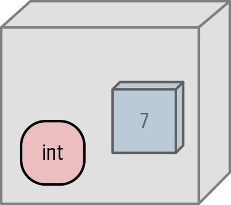
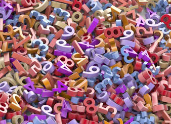
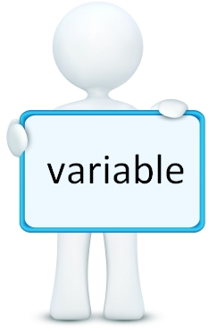

# Introduction to Python

# Python Data are Objects

* In Python , an object is a chunk of data that contains at least the following:
  * A _type_ that defines what it can do
  * A unique _id_ to distinguish it from other objects
  * A _value_ consistent with its type
  * A _reference count_ that tracks how often this object is used

Python is _Strongly typed_ language, means type of the object does not change\.

Reference: Introducing python 2ndEdition by BillLubanovic,O’reilly

# Python Data types

Numbers

Strings

Boolean

Sequence Types

Mapping Types

Set types

Binary types

# Numbers

Numbers are divided into int, float and complex numbers\.

Numbers: integers

Literal Integers :

Any sequence of digits in Python represents a _literal_ integer

Operator Precedence: Numbers perspective

Python 2\.x:

Int could be limited to 32 or 64 bits, depending on your CPU\.

32 bit:  –2,147,483,648 to 2,147,483,647

long	64 bit: –9,223,372,036,854,775,808 to 9,223,372,036,854,775,807

Python 3\.x:

Int can be any size >64 bits

0o or 0O for octal \(base 8\)

0x or 0X for hex \(base 16\)

value=64

bin\(value\)

oct\(value\)

hex\(value\)

Integers are whole numbers, but floating point numbers have decimal points\.

Floats can include a decimal integer exponent after the letter e\.

'''
>>> 5e0

5\.0

>>>5e1

50\.0

>>>5\.0e1

50\.0

>>>5\.0 \* \(10\*\*1\)

>>> 5\.0

5\.0

>>>05\.0

5\.0

>>> 1\_000\_000\.0

1000000\.0

>>>1\.0\_0\_1

1\.001'''

_Complex Numbers:_

In python, you can put ‘j’ or ‘J’ after a number to make it imaginary, so you can write complex literals easily:

'''>>> z=x\*y

>>> print z

\(\-5\+10j\)

>>> z

>>> print z

\(0\.44\+0\.08j\)

>>> printx\.conjugate\(\)

\(1\-2j\)

>>> printx\.imag

2\.0

>>> printx\.real

1\.0

>>> x=complex\(1,2\)

>>> print x

\(1\+2j\)

>>> y=complex\(3,4\)

>>> print y

\(3\+4j\)

>>> z=x\+y

>>> print x

\(1\+2j\)

>>> print z

\(4\+6j\)

>>> 1j

1j

>>> 1J

1j

>>> 1j \* 1j

\(\-1\+0j\)'''

<spanle="color:#FFFFFF"> _Boolean Datatypes :_ ./img/span>

'''>>> 'Snap’

'Snap’

>>> "Crackle“

'Crackle''''

The main purpose is to create strings containing quote characters\. You can have single quotes inside double\-quoted strings, or double quotes inside single\-quoted strings\.

'''>>> "'Nay\!' said the naysayer\. 'Neigh?' said the horse\."

"'Nay\!' said the naysayer\. 'Neigh?' said the horse\."

>>> 'The rare double quote in captivity: "\.'

'The rare double quote in captivity: "\.'

>>> 'A "two by four" is actually 1 1⁄2" × 3 1⁄2"\.'

'A "two by four" is actually 1 1⁄2" × 3 1⁄2"\.'

>>> "'There's the man that shot my paw\!' cried the limping hound\."

"'There's the man that shot my paw\!' cried the limping hound\."'''

You can also use three single quotes \('''\)or three double quotes \("""\): Their most common use is to create _multiline strings_

'''>>> poem =  '''There was a Young Lady of Norway,

\.\.\. Who casually sat in a doorway;

\.\.\. When the door squeezed her flat,

\.\.\. She exclaimed, "What of that?"

\.\.\. This courageous Young Lady of Norway\.'''

>>>'''

By the way, there’s a difference between the output of print\(\) and the automatic echoing done by the interactive interpreter:

print\(\) strips quotes from strings and prints their contents\. It’s meant for human output\. It helpfully adds a space between each of the things it prints, and a newline at the end:

'>>> print\('Give', "us", '''some''', """space"""\)'

Give us some space

'''>>> ‘’

‘’

>>> "“

‘’

>>>''‘’’’

‘’

>>>"""""“

‘’

>>>'''

_Create with str\(\)_

You can make a string from another data type by using the str\(\) function:

'''>>> str\(98\.6\)

'98\.6'

>>> str\(1\.0e4\)

'10000\.0'

>>> str\(True\)

'True''''

Python uses the str\(\) function internally when you call print\(\) with objects that are not strings and when doing string formatting, which you’ll see later in this chapter\.

Python lets you escape the meaning of some characters within strings to achieve effects that would otherwise be difficult to express\. By preceding a character with a backslash \(\\\),you give it a special meaning\.

'''>>> palindrome = 'A man,\\nA plan,\\nA canal:\\nPanama\.’

>>> print\(palindrome\)

A man,

A plan,

A canal:

Panama\.'''

# Variables in Python

* _Vale_ —name for values in your computers memory that you want to use in a program\.
* Python variable names have some rules:
* They can contain only these characters:
  * Lowercase letters \(a through z\)
  * _Uppercase letters \(A through Z\)_
  * _Digits \(0 through 9\)_
  * _Underscore \(\_\)_
* They are case\-sensitive: thing, Thing, and THING are different names\.

They must begin with a letter or an underscore, not a digit\.

Names that begin with an underscore are treated specially

They cannot be one of Python’s reserved words \(also known as keywords\)\.

False		await		else		import		pass                                                                                            None		break		except		in		raise                                                                                              True		class		finally		is		return                                                                                                  and		continue	for		lambda	try                                                                                                  as		def		from		nonlocal	while                                                                                           assert		del        	global     	not        	with                                                                                                               asyncelifif         		or         		yield

# Python Built-in Data types:

Text type:	str

Numeric Types:int,float,complex

Sequence Types:	list, tuple, range

Mapping Types:dict

Set Types:		set

Boolean Type:	bool

Binary Types:	bytes,bytearray,memoryview

