U\. Joshua,

Asst\. Professor,

Dept\. of CSE,

jhashuva@cvr\.ac\.in

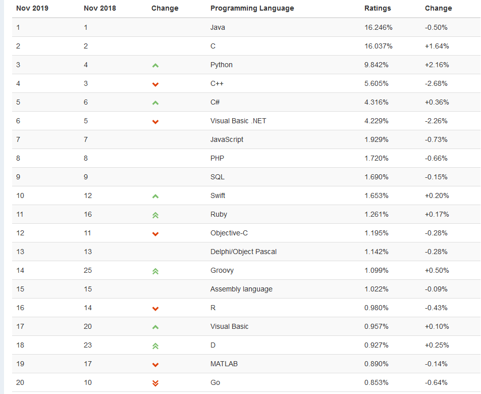

Ref:[Source: TIOBE](https://www\.tiobe\.com/tiobe\-index/)

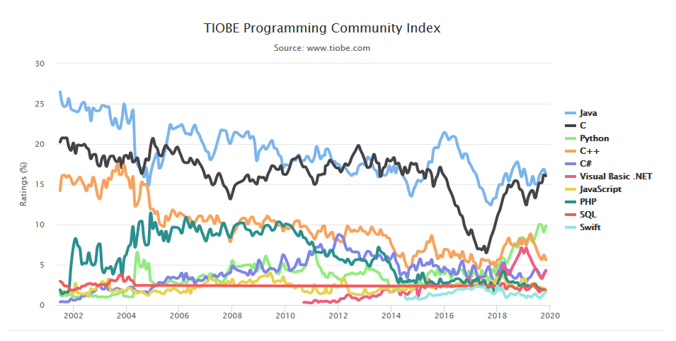

Ref:[Source: TIOBE](https://www\.tiobe\.com/tiobe\-index/)

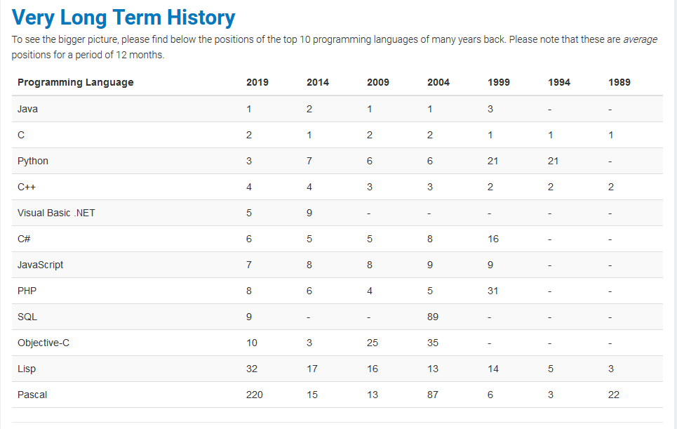

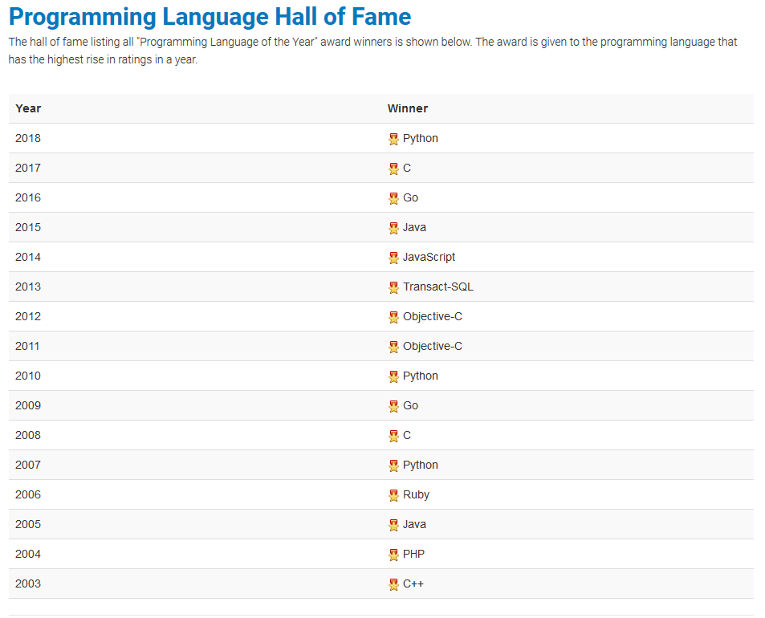

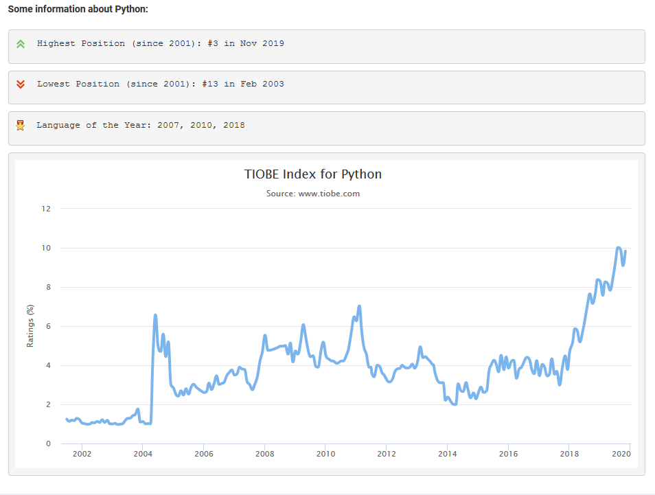

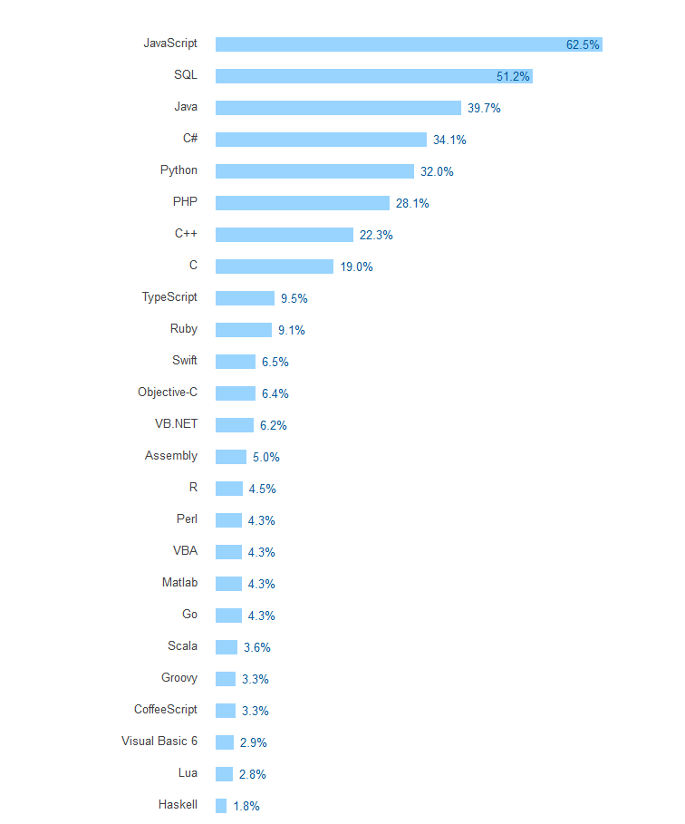

Ref:[Stackoverflow survey 2017] (https://insights\.stackoverflow\.com/survey/2017)

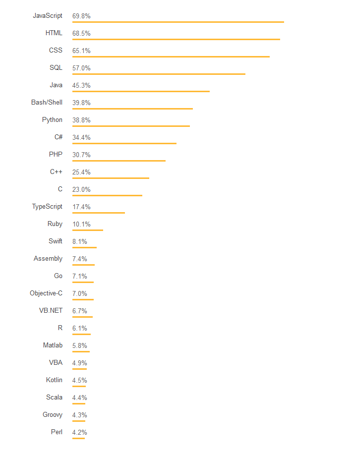

Ref:[Stackoverflow survey 2018](https://insights\.stackoverflow\.com/survey/2018\#technology)
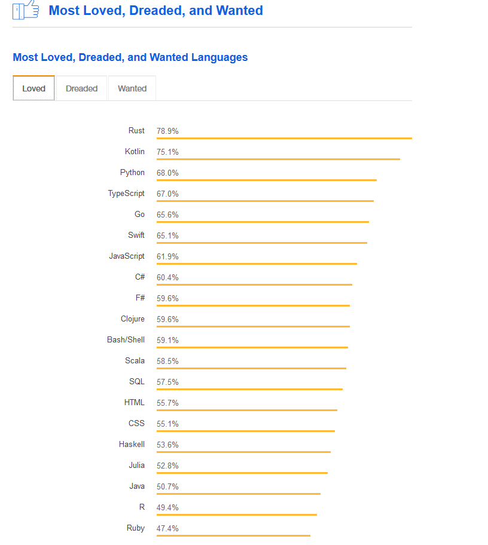

Ref:[Stackoverflow survey 2018](https://insights\.stackoverflow\.com/survey/2018\#technology)

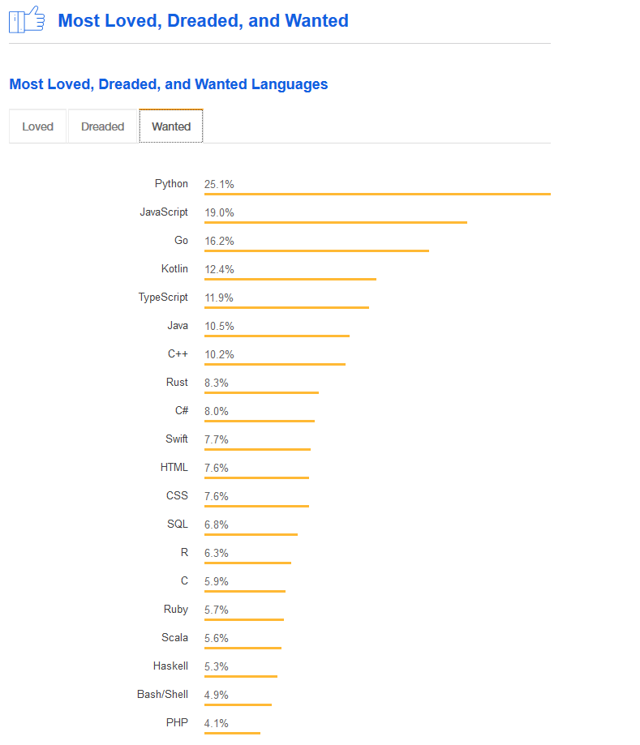

Ref:[Stackoverflow survey 2018](https://insights\.stackoverflow\.com/survey/2018\#technology)

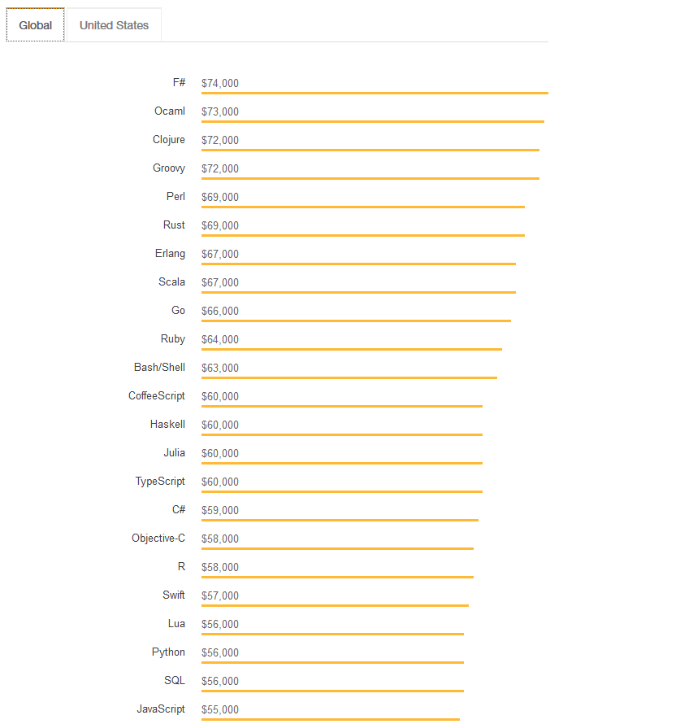

Ref:[Stackoverflow survey 2018](https://insights\.stackoverflow\.com/survey/2018\#technology)

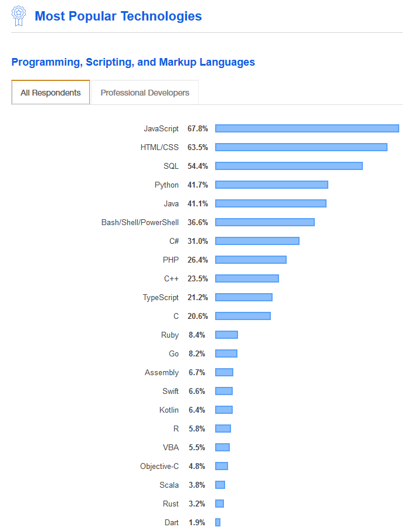

https://insights\.stackoverflow\.com/survey/2019

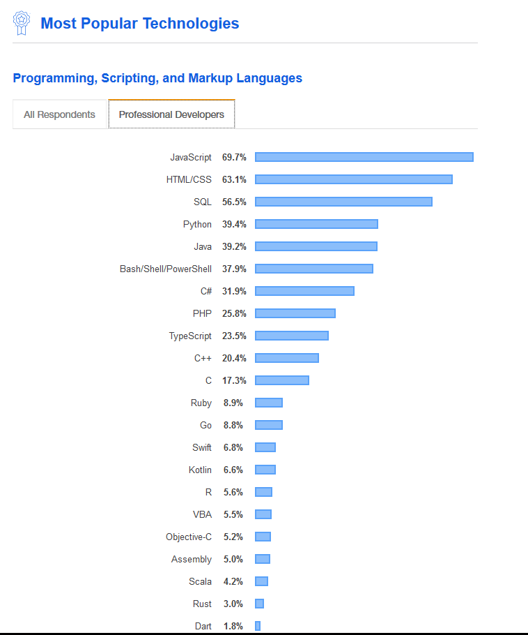

Ref:[Stackoverflow survey 2019](https://insights\.stackoverflow\.com/survey/2019)

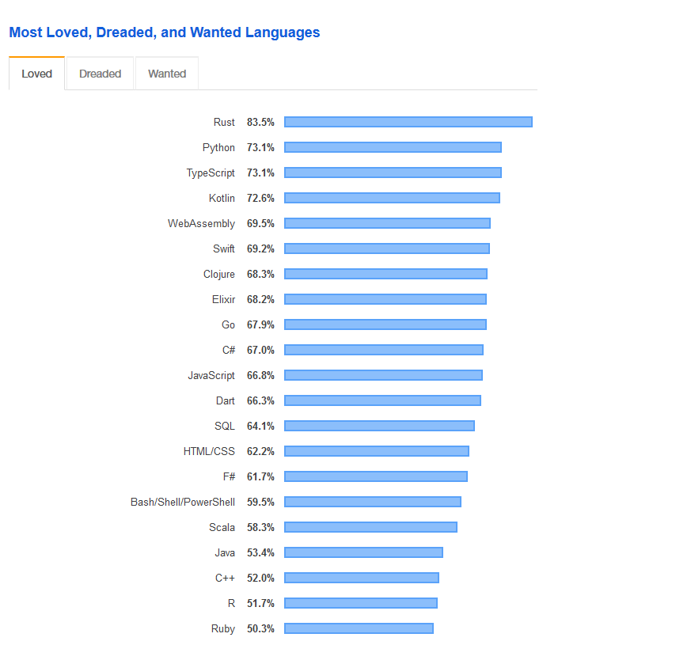

Ref:[Stackoverflow survey 2019](https://insights\.stackoverflow\.com/survey/2019)

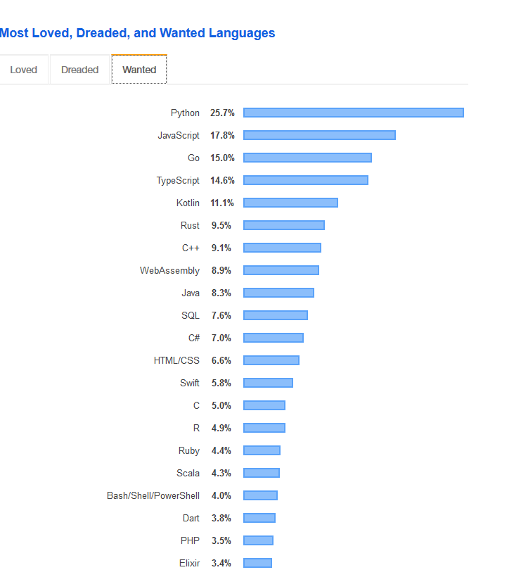

Ref:[Stackoverflow survey 2019](https://insights\.stackoverflow\.com/survey/2019)

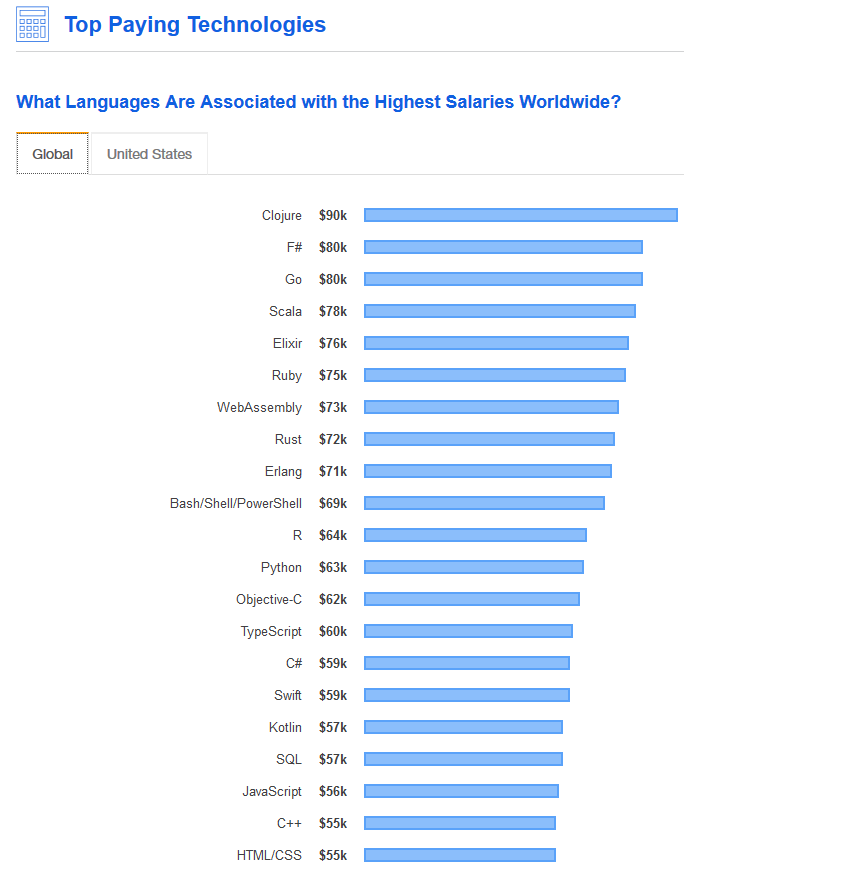

Ref:[Stackoverflow survey 2019](https://insights\.stackoverflow\.com/survey/2019)

